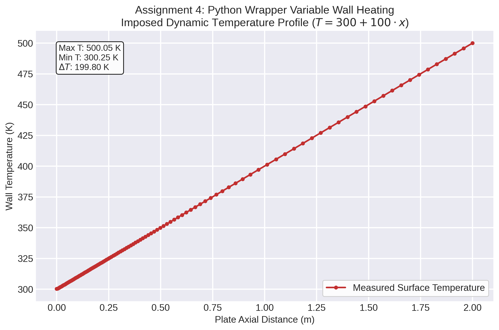
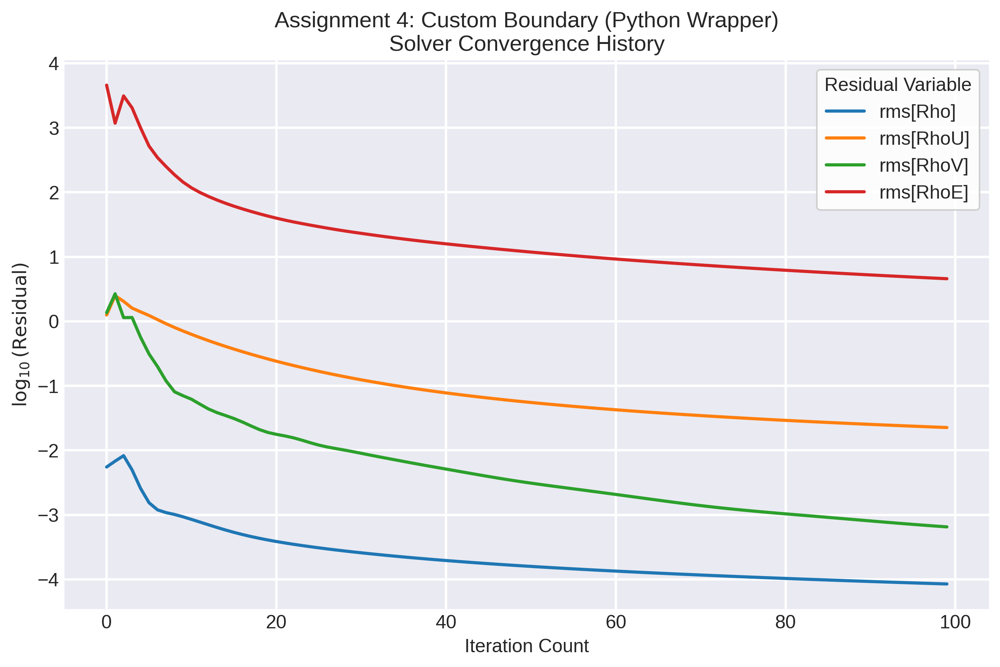

# Assignment 4: Spatially Varying Wall Temperature via Python Wrapper

For Assignment 4, I had to figure out how to programmatically control boundary conditions using the SU2 Python wrapper (`pysu2`). Instead of just running a simulation, the goal was to drive it from Python and apply a custom, spatially varying temperature gradient along the wall of a flat plate.

## What I Did

I started with the standard RANS flat plate case (using the Spalart-Allmaras turbulence model). To hand control over to Python, I tweaked `turb_SA_flatplate.cfg`:
- Added `MARKER_PYTHON_CUSTOM= ( wall )` so SU2 knows to expect custom boundary instructions from the Python script.
- Kept `MARKER_ISOTHERMAL= ( wall, 300.0 )` as a baseline, but the script basically overrides this.

Then, I wrote `run_flatplate_temp.py` to actually steer the simulation. Here is what the script is doing step-by-step:

1. **Initializing:** It boots up the SU2 driver (`pysu2.CSinglezoneDriver`).
2. **Finding the nodes:** It grabs the coordinates of all the nodes that make up the 'wall' marker.
3. **Calculating the math:** For each node's x-coordinate, it calculates a linear temperature gradient: $T(x) = T_{ref} + 100.0 \cdot x$, where $T_{ref}$ is 300 K.
4. **Applying the temperature:** It pushes these custom calculated temperatures back into the solver using `SetMarkerCustomTemperature`.
5. **Running:** Finally, it steps the solver forward for 100 iterations.

## Results

I ran the script and it completed the 100 iterations successfully. To verify it actually worked, I opened the generated `surface_flow.vtu` file in ParaView. The `Temperature` field perfectly matched the linear gradient I coded up in the Python script. 

This demonstrates the utility of the SU2 Python wrapper for prototyping and implementing dynamic boundary conditions without requiring modifications to the core C++ framework.

