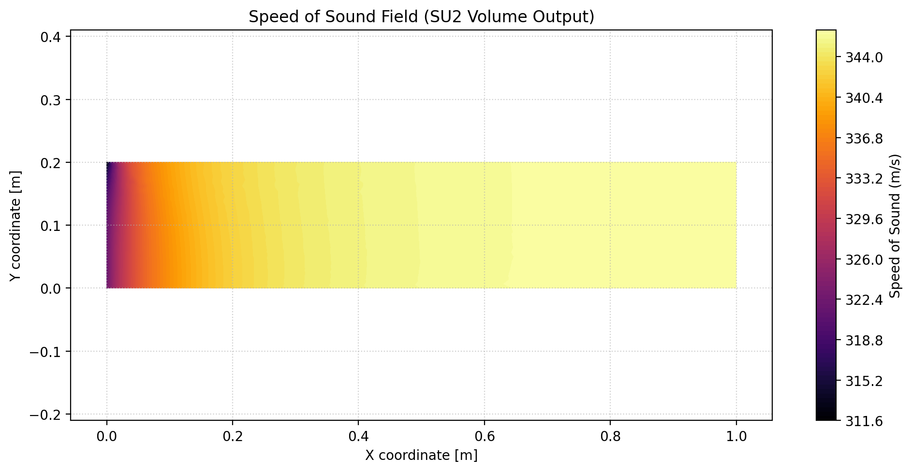

# Assignment 5: Adding Speed of Sound to SU2 Output

## What I Did

The goal was to expose the local speed of sound — which SU2 already computes internally — as a proper output field so that it shows up in ParaView (volume output) and in the screen/history logs.

SU2 already calculates the speed of sound at every grid point (it needs it for computing the Mach number, for example), but it never writes it out as its own field. So the work here was about hooking into the existing output infrastructure, not implementing new physics.

I made all changes on a dedicated branch: `feature/add-sound-speed-output`, branched off `develop`.

## The Code Changes

Everything lives in one file: `SU2_CFD/src/output/CFlowCompOutput.cpp`. Four small additions:

### Registering the fields

In `SetHistoryOutputFields`, I added a line to register the speed of sound as a screen/history output under the `FLOW_COEFF` group. This makes it available for `SCREEN_OUTPUT` and `HISTORY_OUTPUT` in the config file:

```cpp
AddHistoryOutput("SOUND_SPEED", "SoundSpeed", ScreenOutputFormat::SCIENTIFIC,
                 "FLOW_COEFF", "Average speed of sound");
```

Similarly, in `SetVolumeOutputFields`, I added it under the `PRIMITIVE` group (right next to Mach, Pressure, Temperature — which makes sense since they're all primitive variables):

```cpp
AddVolumeOutput("SOUND_SPEED", "Sound_Speed", "PRIMITIVE", "Speed of sound");
```

### Loading the data

In `LoadVolumeData`, I added one line that grabs the local sound speed at each grid point. The function `GetSoundSpeed(iPoint)` is already there in `CFlowVariable` — it's what SU2 uses internally to compute the Mach number:

```cpp
SetVolumeOutputValue("SOUND_SPEED", iPoint, Node_Flow->GetSoundSpeed(iPoint));
```

For the history/screen output, I needed a single representative value rather than per-point data. I went with a domain average — loop over all points, sum up the sound speeds, divide by the point count, then do an MPI reduction so it works in parallel:

```cpp
su2double avg_a = 0.0;
for (unsigned long iPoint = 0; iPoint < geometry->GetnPointDomain(); iPoint++) {
  avg_a += flow_solver->GetNodes()->GetSoundSpeed(iPoint);
}
avg_a /= su2double(geometry->GetnPointDomain());
SU2_MPI::Allreduce(&avg_a, &avg_a, 1, MPI_DOUBLE, MPI_SUM, SU2_MPI::GetComm());
avg_a /= su2double(SU2_MPI::GetSize());
SetHistoryOutputValue("SOUND_SPEED", avg_a);
```

## Config Settings

To actually see the new field, the config needs to request it. Here are the relevant lines from `jet_sound.cfg`:

```ini
% PRIMITIVE group pulls in Sound_Speed alongside Pressure, Temp, Mach, etc.
VOLUME_OUTPUT= (COORDINATES, SOLUTION, PRIMITIVE)

% SOUND_SPEED on the screen shows the domain-averaged value each iteration
SCREEN_OUTPUT= (INNER_ITER, RMS_DENSITY, RMS_TKE, RMS_DISSIPATION, SOUND_SPEED)

% FLOW_COEFF includes SoundSpeed in the CSV
HISTORY_OUTPUT= (ITER, RMS_RES, FLOW_COEFF, FLOW_COEFF_SURF)
```

## Results

I ran the turbulent jet case (same mesh as Assignment 2) for 500 iterations. Here's what I got:

### Screen output

The speed of sound shows up as the 4th column on screen:

```
|   Inner_Iter|     rms[Rho]|       rms[k]|   SoundSpeed|
|         496|   -2.768572|   -4.196406|  3.3830e+02|
|         497|   -2.767752|   -4.195768|  3.3830e+02|
|         498|   -2.771443|   -4.096713|  3.3830e+02|
|         499|   -2.735461|   -4.059887|  3.3830e+02|
```

### History CSV

`SoundSpeed` shows up as column 24 in `history.csv`. It starts at about 343.7 m/s (which is roughly the standard speed of sound in air at 20°C) and settles to ~338.3 m/s as the flow develops:

| Iteration | SoundSpeed (m/s) |
|-----------|-----------------|
| 0         | 343.75          |
| 250       | 338.29          |
| 499       | 338.30          |

### Volume output

The VTU file now has a `Sound_Speed` data array that can be opened in ParaView, or custom rendering scripts.

```xml
<DataArray type="Float32" Name="Sound_Speed" NumberOfComponents="1" .../>
```

Here is a 2D contour visualization of the local sound speed generated directly from `vol_solution.vtu` using Matplotlib:



This lets you see how the speed of sound varies spatially across the domain — it is slightly different in the hot jet core versus the ambient coflow.

## How to Reproduce

```bash
# Switch to the feature branch and rebuild
cd ~/SU2
git checkout feature/add-sound-speed-output
ninja -C build install

# Run the case
cd ~/SU2-GSoC-Assignments/Assignment5
~/SU2/build/install/bin/SU2_CFD jet_sound.cfg

# Quick checks
head -1 history.csv | tr ',' '\n' | grep -n Sound   # should show column 24
strings vol_solution.vtu | grep Sound                # should show Sound_Speed
```
